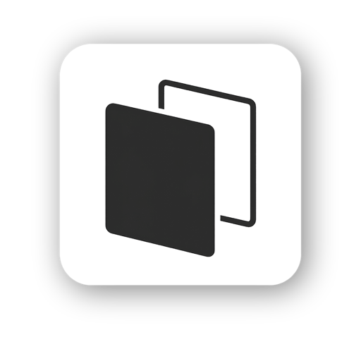

<p align="center">
  
</p>

<h1 align="center">Flickwall</h1>

<p align="center">
  <a href="https://github.com/tamo2918/Flickwall/actions/workflows/ci.yml">
    
  </a>
</p>

<p align="center">
  <a href="README.md">English</a> | 日本語
</p>

Flickwall は、Command-Tab のアプリ切り替えに近いオーバーレイで操作できる
ネイティブ macOS 向け壁紙切り替えアプリです。画像ファイルやフォルダを登録し、
グローバルショートカットでスイッチャーを開き、プレビューを移動して、システム設定を
開かずに選択した壁紙を適用できます。

## デモ

<p align="center">
  
</p>

## ダウンロード

[GitHub Releases](https://github.com/tamo2918/Flickwall/releases/latest) から最新の
`.dmg` をダウンロードし、開いたあと `Flickwall.app` を `Applications` にドラッグしてください。

現在の GitHub バイナリは notarize されていないプレビュービルドです。初回起動時に
macOS の警告が出る場合があります。ダウンロードした Release を信頼できる場合は、
右クリック > 開く から起動してください。

## 機能

- デフォルト `Option + Command + W` のグローバル壁紙スイッチャーショートカット
- 設定画面で変更できるショートカットレコーダー
- キーボード操作に対応した横並びの壁紙プレビューオーバーレイ
- ライブラリ、スイッチャー、インポート操作を開けるメニューバー項目
- 画像ファイルのインポートとフォルダの自動同期
- お気に入りと最近使った壁紙
- セキュリティスコープ付きブックマークによるサンドボックス対応のファイルアクセス
- メモリキャッシュ付きの非同期サムネイル生成
- 接続中のすべてのディスプレイに同じ壁紙を適用

## 必要環境

- macOS 26.2 以降
- Xcode 26.2 以降

このプロジェクトは Liquid Glass 効果を含む新しい macOS SwiftUI API を使用しているため、
現在は macOS 26.2 SDK を対象にしています。

## ソースからビルド

リポジトリをクローンして、次のコマンドを実行します。

```bash
./script/build_and_run.sh --verify
```

`Flickwall.xcodeproj` を Xcode で開き、`Flickwall` スキームを実行することもできます。

ローカル開発では、Xcode の署名設定で自分の Mac 上で実行できます。Mac App Store 以外で
公開バイナリを配布する場合は、自分の Apple Developer Program アカウント、Developer ID
署名、notarization を使用してください。

## テスト

```bash
xcodebuild test \
  -project Flickwall.xcodeproj \
  -scheme Flickwall \
  -configuration Debug \
  -derivedDataPath build/DerivedData \
  -only-testing:FlickwallTests
```

## ファイルアクセスの仕組み

Flickwall は壁紙画像ファイル自体をアプリ内にコピーしません。メタデータと
セキュリティスコープ付きブックマークを保存し、サンドボックス化されたアプリが
ユーザーの選択したファイルにアクセスできるようにしています。

保存されるデータは次のとおりです。

- 表示名
- 元のファイルパス
- フォルダから追加した場合の同期元フォルダパス
- セキュリティスコープ付きブックマークデータ
- お気に入り状態
- 追加日時
- 最後に適用した日時

ライブラリのメタデータは次の場所に保存されます。

```text
~/Library/Application Support/Flickwall/wallpapers.json
```

同期元フォルダのメタデータは次の場所に保存されます。

```text
~/Library/Application Support/Flickwall/folders.json
```

サムネイルは元のファイルから生成され、メモリ内にのみキャッシュされます。

## プライバシー

Flickwall はローカル専用アプリです。分析、テレメトリ、トラッキング、広告、
アカウントログイン、ネットワーク機能は含まれていません。アプリが読み取るのは、
ユーザーが macOS のファイルピッカーで選択した画像ファイルとフォルダだけです。

## 既知の制限

- 選択した壁紙は接続中のすべてのディスプレイに適用されます。
- 個別に追加した画像ファイルは、元ファイルが削除され、ブックマークでも解決できない場合は表示できなくなります。
- GitHub Release のビルドはまだ notarize されていないため、macOS の初回起動警告が出る場合があります。

## 開発メモ

- メインアプリのソースは `Flickwall/` にあります。
- ユニットテストは `FlickwallTests/` にあります。
- UI テストは `FlickwallUITests/` にあります。
- `script/build_and_run.sh` が標準のローカルビルド・実行エントリーポイントです。
- AI コーディングエージェント向けの指示は [AGENTS.md](AGENTS.md) にあります。

## ライセンス

Flickwall は MIT License の下で公開されています。詳しくは [LICENSE](LICENSE) を参照してください。
